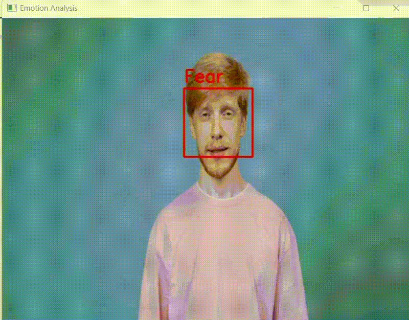
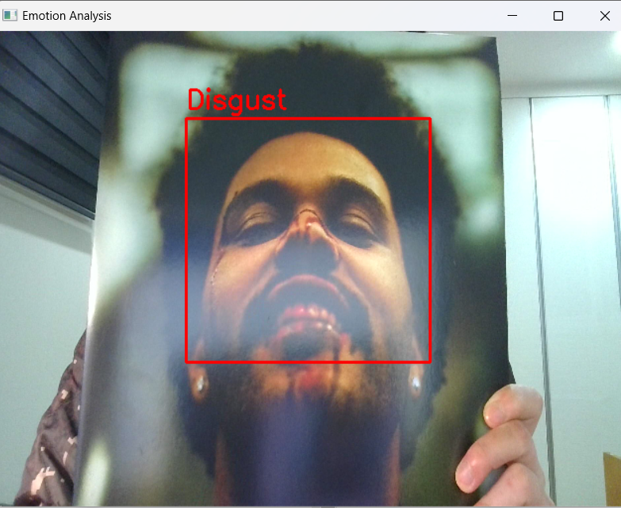
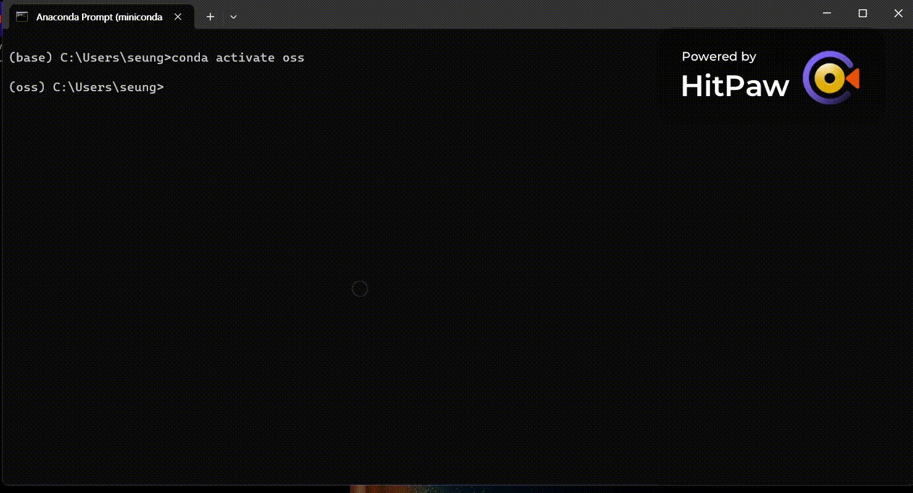

# ***Emotion Analzer***
###### by TEAM OpenSource PUREA
---
#### OUTLINE
Using a webcam, it analyzes the facial expression of the person reflected and the facial expression of the person in the video.
supportive emotions like: ['Angry', 'Disgust', 'Fear', 'Happy', 'Sad', 'Surprise', 'Neutral']



#### Pacakges you Need for using this
---
1. [**haarcascade_frontalface_defualt.xml**](https://github.com/kipr/opencv/blob/master/data/haarcascades/haarcascade_frontalface_default.xml)
2. [**Emotion_little_vgg.h5**](https://github.com/crashoverloaded/Facial_expressions_Recognition/blob/master/Emotion_little_vgg.h5)
3. pip install numpy, tensorflow AND open-cv


#### USAGE
---
##### WEBCAM analyze
- Activate python file
```
$python Analzye.py
```
- Input '1' to Enter webcame version
```
$ Enter 1 for webcam or 2 for video file:
$ 1
```

##### VIDEO analyze
- Activate python file
```
$python Analzye.py
```
- Input '2' to Enter webcame version.
```
$ Enter 1 for webcam or 2 for video file:
$ 1
```
- Input the file directory/name And extension. 
```
$ Enter the path to the video file:
$ ./fileName.exTension
```

#### Test
---
##### WEBCAM

##### VIDEO

#### Licence

--- 
Open souced under MIT Licence


